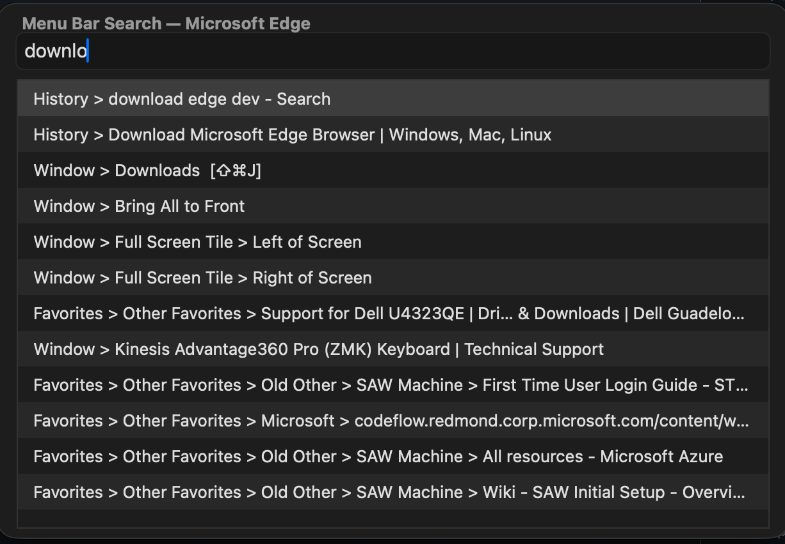
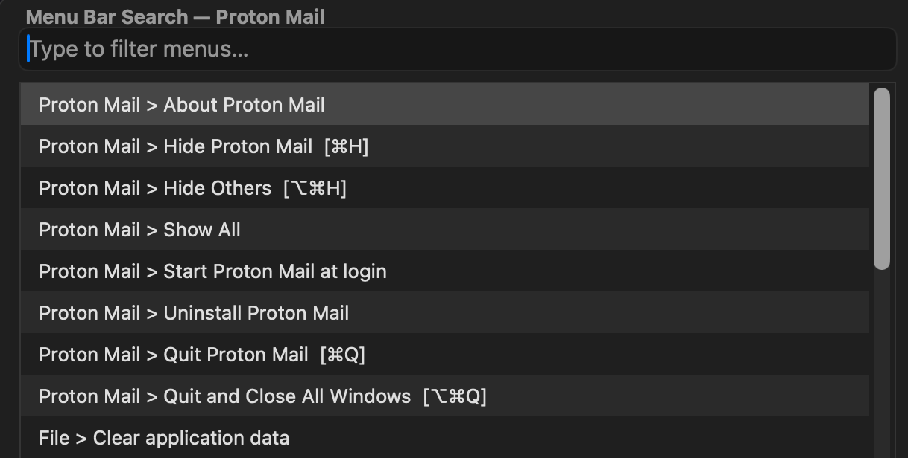

#  MenuBarPicker

A native macOS menu-bar search tool.  Type to fuzzy-filter every menu
item of the frontmost application, then press Enter to click it.

<span>
  
  
</span>


## Features

- **Standalone Swift executable** — no runtime dependencies, no Xcode project
- **Live fuzzy filtering** with scored ranking (word-initial + subsequence)
- **Keyboard navigation** — Up / Down / Enter / Escape
- **Automatic PID resolution** — skips Shortcuts / BackgroundShortcutRunner
- **Accessibility prompting** — detects missing TCC permission and opens System Settings
- **Focus restoration** — reactivates the target app and re-enumerates the menu bar before clicking
- **Apple Shortcuts compatible** — works as a single "Run Shell Script" action


## Quick start

```bash
# Build (requires Xcode command-line tools)
./build.sh

# Run
./MenuBarPicker            # auto-detect frontmost app
./MenuBarPicker -pid 1234  # target a specific PID
./MenuBarPicker -v         # verbose: show PID resolution timing
./MenuBarPicker --benchmark # benchmark all PID resolution strategies
```


## Build from source

The picker is a single-file Swift executable with no external packages:

```bash
swiftc -O -o MenuBarPicker scripts/MenuBarPicker.swift \
  -framework Cocoa -framework ApplicationServices
```

Or use the included build script:

```bash
./build.sh
```


## Accessibility / TCC setup

MenuBarPicker uses the macOS Accessibility API to read and click menu items.
The app bundle is signed with a stable `CFBundleIdentifier`
(`com.gungazoo.MenuBarPicker`), so TCC permission survives rebuilds.

1. **System Settings → Privacy & Security → Accessibility**
2. Remove any old `MenuBarPicker` entries (bare binaries from before the `.app` bundle)
3. Add `MenuBarPicker.app` (drag from Finder, or click `+` and navigate to it)
4. The identity is now stable — rebuilds no longer require re-adding


## Apple Shortcuts integration

1. Create a new Shortcut
2. Add **Run Shell Script** with these settings:
   - **Shell**: `/bin/bash`
   - **Input**: No Input
   - **Pass Input**: (leave default / to stdin)
3. Paste the **full path to the binary inside the bundle**:
   ```bash
   /Applications/MenuBarPicker.app/Contents/MacOS/MenuBarPicker
   ```
   Or use the convenience symlink at the repo root:
   ```bash
   /Applications/MenuBarPicker/MenuBarPicker
   ```
4. Assign a keyboard shortcut to the Shortcut

> **⚠️ Do NOT use any of these — they will break PID detection or fail:**
> - `open MenuBarPicker.app` — launches asynchronously, steals focus, breaks target-app detection
> - `MenuBarPicker.app` — this is a directory, not an executable (`cannot execute binary file`)
> - An "Open App" Shortcuts action — same focus-stealing problem as `open`

The picker handles everything: PID detection, menu enumeration, UI, focus
restoration, and clicking.


## Project layout

```
MenuBarPicker.app/         ← signed .app bundle (after build)
  Contents/
    Info.plist
    MacOS/MenuBarPicker    ← compiled binary
MenuBarPicker              ← convenience symlink → .app binary
build.sh                   ← build script
Info.plist                 ← bundle metadata (copied into .app by build.sh)
scripts/
  MenuBarPicker.swift      ← standalone picker source (single file)
assets/                    ← screenshots and icons
```


## Credits

Based on the concept from [BenziAhamed/Menu-Bar-Search](https://github.com/BenziAhamed/Menu-Bar-Search),
originally an Alfred Workflow by Benzi Ahamed (Copyright © 2017), itself
inspired by ctwise's ObjC
[Menu Bar Search](https://www.alfredforum.com/topic/1993-menu-search/).

MenuBarPicker is a standalone rewrite using native AppKit — the fuzzy
search, picker UI, PID resolution, and Shortcuts integration are original
code.  The Accessibility menu-enumeration technique (walking AXMenuBar →
AXMenuItem) is a standard macOS API pattern.

The upstream repository does not include a license file.  This derivative
work does not claim any license over upstream-originated code.  The files
in this repository that are original work are available under the terms
of the [MIT License](https://opensource.org/licenses/MIT).
